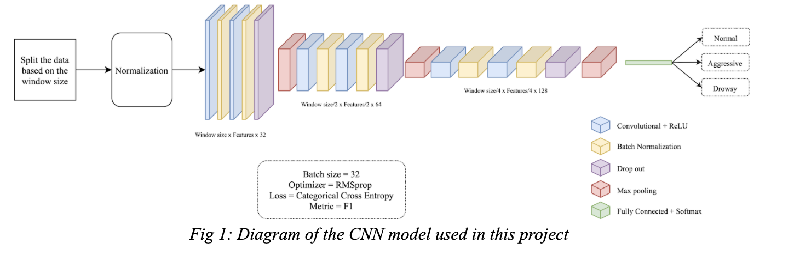
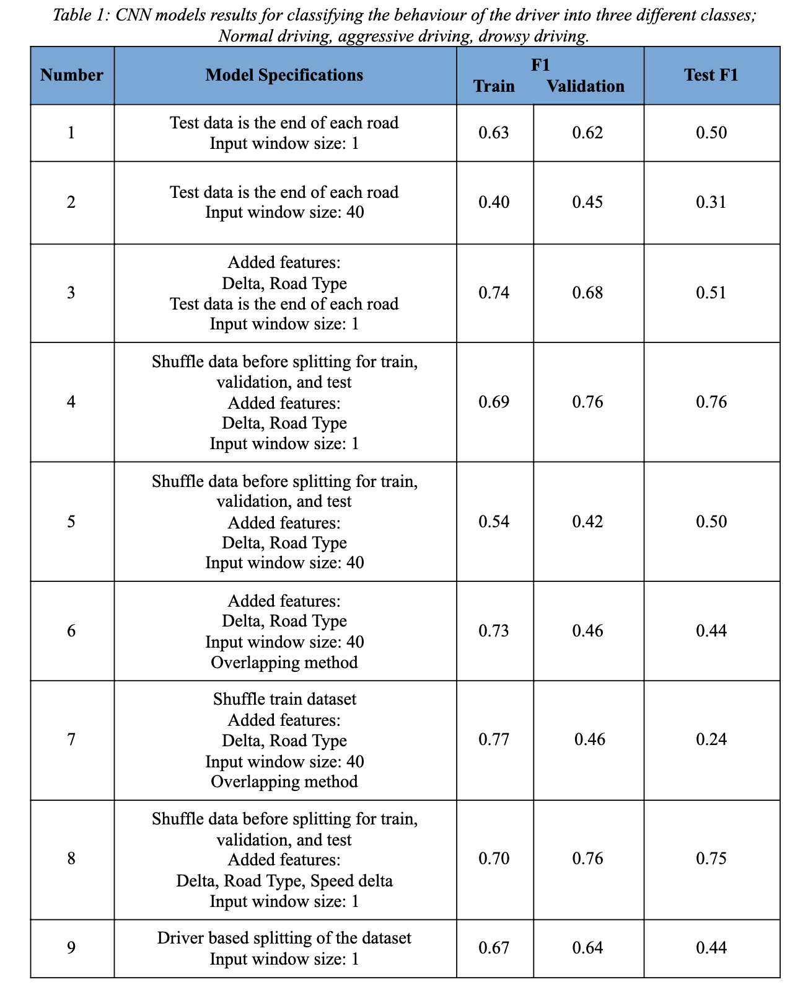
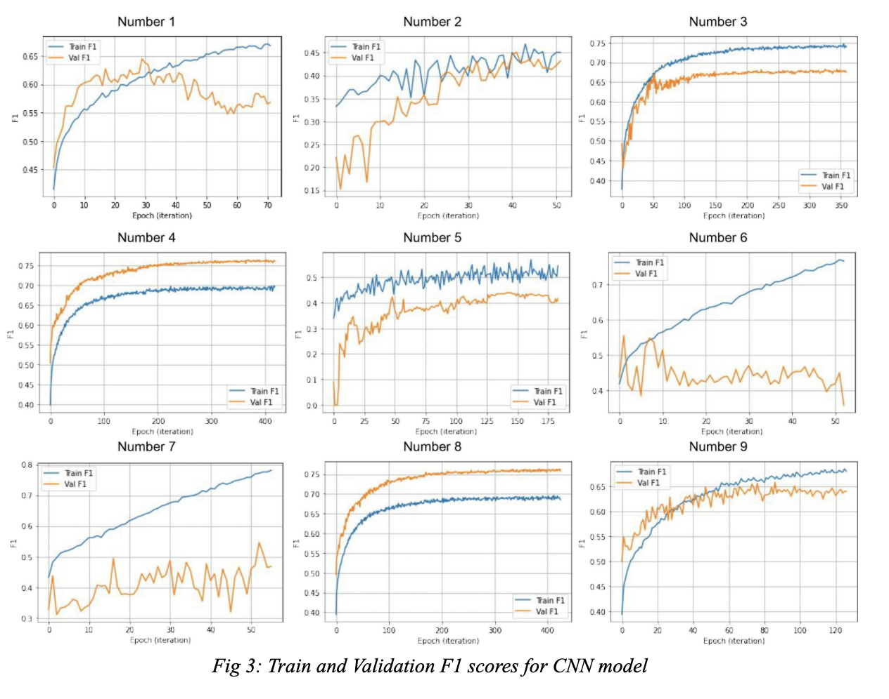
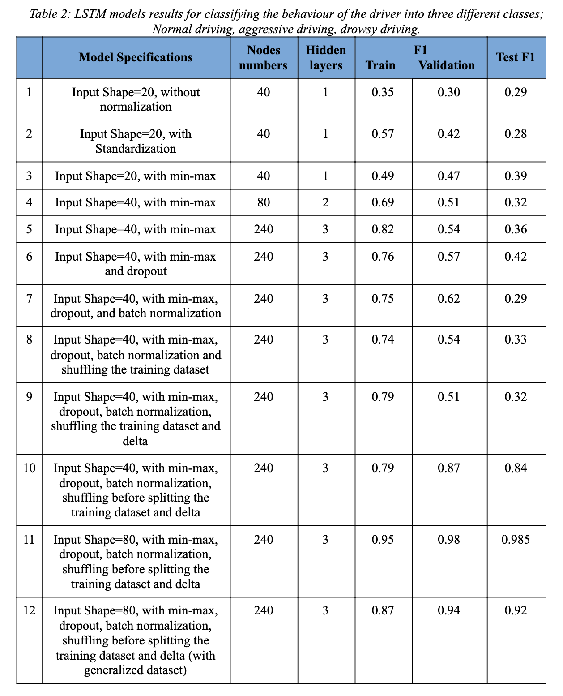
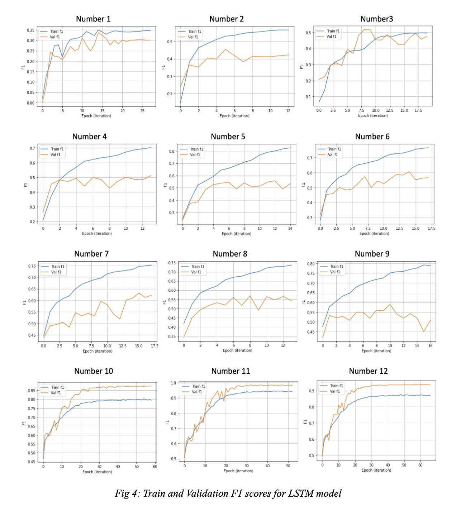

# Driving Behaviour Classification Based on Deep Learning Algorithms

> Team Members: Navid Akbari, Ali Shahidi, Farid Talebloo, Sonali Keshava Murthy Naik


**Introduction**

Given traffic accidents, fuel consumption, and vehicle degradation, the DBA (Driving behaviour analysis) provides in-view details on several vehicle inputs under varying conditions. Based on the World Health Organization (WHO) reports, an investigation into driving behaviour is warranted since it is one of the main variables involved in this accident. Altitude, drunkenness, exhaustion, dim road flow, vision deficiency, and automobile performance considerations are examples of driver factors [1]. Different types of sensors linked to a control area network may be used to track driving behaviour. Driving behaviour data are the calculated multi-dimensional time-series data. In some instances, the time series data dimensions are not statistically independent [2]. A successful representation of driving characteristics can be crucial for autonomous driving, auto insurance, and various other application scenarios. On the other hand, traditional methods rely heavily on handcrafted features, restricting the ability of machine learning algorithms to achieve superior efficiency [3]. Driving is a dynamic task that necessitates several levels of ability (e.g., acceleration, braking, turning). Driving behaviour analysis will help us evaluate driver efficiency, enhance traffic safety, and, eventually, encourage intelligent and resilient transportation systems. Although some attempts have been made to analyze driving behaviour, current approaches can be enhanced by representation learning by jointly exploring driving behaviour's peer and temporal dependencies [4]. Everyone has distinct driving patterns, such as a set speed, acceleration, and braking pattern, compared to a fingerprint [5]. Many reports on road safety have primarily concentrated on factors associated with severe and fatal accidents, and as a result, less effort has been made on minor injuries or pre-crash situations, owing to underreporting [6]. This reality can lead to skewed assumptions in injury prevention and management. While this subject has received much coverage in the past, there is still a lot to learn about it, such as the dimensions of driving patterns and their possible impact on road safety [7].

**Objectives**

As has been described as the significance of driving behaviour detection in the previous section, we decided to use supervised data on how various drivers drive, driving route data points of latitude, longitude, and longitude. This analysis is highly time-sensitive and needs a model that could determine the relationship between the data points. Therefore, we decided to implement the architectures with memory, such as Long Short Term Memory (LSTM). Also, we try to implement different CNN models in this phase of the project to see whether CNN model works on our dataset or not.

**Lesson learned of previous stages**

In the last phase of this project, we first introduced the dataset that we used and its challenges, then we went through our methodology for data processing and implementing different Fully Connected Networks’ (FCNN) architectures and at the end, explained why FCNN is not a proper model for our time-series problem. A summary of midterm: 
As we analyzed different datasets and as explained in the previous report, we concluded that the UAH-DriveSet [8] is the best choice for our problem. This dataset consists of 6 different drivers; Each driver drove the two roads, one is 25 km, and maximum allowed speed of 120 km/h, and the other one is 16 km and 90 km/h maximum allowed speed, with three different driving behaviours: normal, drowsy, and aggressive. The RAW_GPS.txt file almost has all the features we need, including speed, latitude, longitude, altitude, vertical and horizontal accuracy, and sampling timestamp, so we used this file to classify the drivers’ behavior. Although this is the best dataset for our problem, it has some challenges. A summary of the challenges and their solutions: 

* Each driver’s behaviour is unique to himself/herself; for example, the normal behaviour of one driver could be different from the others’ normal behaviours. Solution: Our training data consists of all of the drivers by breaking down a trip into smaller batches and giving some of the batches to the system for the learning and the other ones for validation and testing. 
* The dataset's biggest challenge is labelling the whole of one road with one type of driving type. But there are times which the driver drove differently from the specific label. Solution: We decided to ignore it; because of human beings' nature, it is completely normal for a person to change his/her behaviour during a full course of driving. We consider it as noise in the dataset.
* Because of the variation in each driver's driving speed, the number of the data points in each file of the dataset is different from the others. Solution: Breaking our dataset into smaller batches and working on them.  
* To give our data to the model, the dimension of the batches must be the same. For example, for 25 Km road, we could not give 20 Km of one road for the learning in only one batch, and the other 5 Km, 3 Km for testing, and 2 Km for validation, in 2 different batches. Solution: Breaking our dataset into smaller batches with the same size of the data points and working on them.

In the first phase of the project, we implemented different FCNN models to solve our problem. We used the F1-Score metric; we explained the reason for using it in the midterm report to assess the models. Since our problem is a time series supervised classification, as we expected, FCNN was not a proper choice to solve this problem. Because there are some correlations between the data points and FCNN does not have the ability, for example, a memory, to figure out these relationships. Although we tried different approaches and did data preprocessing, such as using Delta, Window size concept, to improve the F1-Score of the FCNN models, the F1-Score did not improve. The best correct result that we got for the testing was 0.57 (F1-Score), in which the test data was from the end of each road, and the window only consisted of one data point. 

**Material and Methods**

Driver behaviour classification by using deep learning techniques, such as CNN [9,10], recurrent neural network (RNN) [10,11], LSTM [11,12], generative adversarial network (GAN) [12], have become very popular in recent years. So in the continuation of the previous phase, and as we didn’t reach a satisfying result in the FCNN algorithm, we decided to try CNN and LSTM models on our dataset to find the best model for our problem. We will discuss each of them in the following sections.

**CNN Approach**

We tried multiple CNN architectures with different parameters and analyzed their results to select the best architecture between them to solve our problem. Fig 1 shows the diagram of the best CNN model we could design for this problem. Furthermore, we tested our architecture with different methods and brought their results into Table 1. 



Like the midterm phase, we tried different approaches for finding the best approach that suits our dataset the best. Some approaches are like the approaches we tried in the midterm but we bring them here again.

* One row as a data point: In the primary methodology, we used each row as a data point and offered them to our model. Seen that this strategy isn't legitimate for our problem as the data points are connected in time, and it’s not logical to classify the behaviour of a driver with only one geographical data point, but still, it worked well. 
* Window size: We know that our dataset is a time-series dataset, and each row has a correlation with the previous and the next row. Also, we know that the driver's current location is not so important at any given time, but the location changes and how it changes are significant for us. Hence we decided to use the window size concept and select a batch of rows as a single data point and give them to the CNN model to check whether it is finding the relationship between different data points. Like the midterm phase, we tested different window sizes, 10, 20, 40, 80, and 100, to find the one that fits our model, and we found out that window size 40 is working better than the other ones, and we kept this window size for our further experiments.
* Delta and road-type features: We added delta and road-type features to our model. Delta could be a better feature to our model because it connects two different data points and helps the model find the correlation between data points. Also, because we have two types of roads, knowing the road could help the model.
Here is a Delta definition: 
```
    Delta_latitude[i]  = Latitude[i] - Latitude[i-1]
    Delta_longitude[i] = Longitude[i] - Longitude[i-1] 
    Delta_altitude[i] = altitude[i] - altitude[i-1]
```
* Shuffling: We decided to select different parts of each road as a test dataset to show the road's whole path to our model. For example, instead of using the first 20 KM of our road for the training and the last 5 for the validation and testing (in the 25 KM road), first, we divide our dataset into the determined window size, then shuffled the data and used 0.2 of batches for testing.
* Sliding window: When we used the window size bigger than one for example 40, the number of the data points reduced dramatically, hence we used the overlapping concept. In this experiment, we used the window size concept like the sliding window and selecting the batches in this manner.
* Speed delta feature: We added a speed delta feature to the dataset because we have two different roads in our dataset which the maximum speed is different in each of them. Hence, this might cause some confusion for our model. Here is the speed delta definition:
```
	If road_type == 1:
		Delta_speed[i] = 90 - speed[i]
	elif road_type == 2:
		Delta_speed[i] = 120 - speed[i]
```
* Driver Based: As our dataset had six different drivers, we decided to split our dataset based on the different drives to make our model more general. We selected four drivers for training and one driver for validation, and one for testing. 

**CNN Challenges**

We faced some challenges during the implementation of the CNN model for our problem. The first challenge was finding the way that we should implement CNN for the text-based problem. We saw lots of examples of CNN implementation on image datasets, but we didn’t know how to deal with the text datasets. Hence, we searched for finding solutions and finding solutions was somehow hard because most of the examples and tutorials on the Internet were about images too, and there was tiny talk about implementing CNN for text datasets.  In the end, we tried to investigate the solution by ourselves, and we went through the Keras documentation and found the Conv1D function, and tried to implement the model by that. The next challenge we faced was finding that one of our best models in CNN that gave us 91% accuracy is not correct. We knew that we shouldn’t expect high accuracy in our CNN model because of our dataset. Our dataset is a time-series dataset, and we knew that CNN couldn’t deal with it very well. But we got a model with 91% accuracy, and so we got confused about it. When we investigated more on the dataset that we gave to the model, we found out that the dataset is wrong, and we gave the whole dataset to the model instead of just the train dataset.


**LSTM Approach**

Following the challenges found in CNN and to best fit our time series dataset we implemented multiple LSTM architectures with different parameters and analyzed their results to select the best architecture between them to solve our problem. Fig 2 shows the diagram of the best LSTM model we could design for this problem. Where the original dataset is split into training, validation and test sets. After which normalization technique is applied, followed by a three hidden layer LSTM model, with dropout, batch normalization, delta, and shuffled training dataset before splitting it. Furthermore, we tested our architecture with different methods and brought their results into Table 2. Finally, we could achieve a 98.5% F1 metric for our best model.
We implemented 12 different models based on the below parameters:

* Input Shape: Starting with input shape of 20 to input shape of 40 and at the end to 80; the accuracy seemed to increase, hence finally fixed the input shape of 80 for our best model.
* Normalization type: As we know, normalization is used to minimize the redundancy from a relation or set of relations. We experimented with two types of normalization, i.e., min-max and standardization; thus, the min-max normalization type came out to be better than the standardization type.
* The number of Hidden Layers: We must use hidden layers to get the best decision boundary; hence we gradually increase the number of hidden layers from one to three, which results better with three hidden layers. Furthermore, we have to add the concept of using the mentioned formula in the challenges section.
* Dropout: Dropout is a technique used to prevent a model from overfitting [13], so after every LSTM layer, adding dropout helped our model avoid overfitting.
* Batch normalization: Batch normalization is a technique to standardize the inputs to a network, applied to either the activations of a prior layer of inputs directly. Batch normalization accelerates training, in some cases by halving the epochs or better, and provides some regularization, reducing generalization error. This certainly helped our model.
* Shuffling the training Dataset: Shuffling the training Dataset: From experiment 10, we realized the problem with our model is that we always sent the final part of each trajectory to the model for the test. However, the model learned 70 percent of the first behaviour of drivers. Nevertheless, with this new approach, i.e. shuffling before splitting the training dataset, the model will have experience of all the driver's behaviour, which resulted in shooting up accuracy above 90 percent.
* Adding Delta: The delta rule is a gradient descent learning rule for updating the weights of the inputs to a neural network [14]. It is a special case of the more general backpropagation algorithm. It helped in slightly improving the accuracy.


**LSTM Challenges**

The first challenge in this method was deciding how to normalize the data before sending it to the model. After several trials and errors, we discovered that the minimum-maximum model produces better results than standardization in this project. The next challenge was to determine the number of layers and neural network nodes. We arrived at the optimal number by using a formula found on this website [15]. The formula is Nh= Nₛ / ((α * (Nᵢ + Nₒ))
Where Nᵢ is the number of input neurons, Nₒ the number of output neurons, Nₛ the number of samples in the training data, and α represents a scaling factor between 2 and 10. 
However, at this point, we spent much time changing the hyperparameters, and we finally realized that because we never sent part of the road data to the model, the validation we did with the test data was not the same as how our model was trained. As a result, we achieved an excellent result of 92 percent using data shuffling.

**Results**

To sum it up, we tried different CNN and LSTM models to find our dataset's best model. As we expected, the LSTM was the best option for tackling our problem because of our problem's time-series nature. In this section, we bring all of our results and will discuss them. Also, we bring all codes and model implementation in our project GitHub repository and you can find them here. Further, for the measurement of our models, we used the F1-score metric because the class distribution is imbalanced, and accuracy would not be an appropriate metric for this problem. F1-score is meaningful here since the cost of false positives could be high and the cost of the false negative is high. We need high precision and recall for our problem.
In table 1, we bring our results which we tested with different features, the shape of input (number of rows in each data point), normalization type (default method is min-max normalization), data processing, etc. As shown in table 1, the best accuracy belongs to models number four and eight, and both of them got shuffled before training, and the latter has one more feature with an F1 score of 0.76 and 0.75, respectively. And they are considerably higher than other scenarios. 



We bring the diagrams of Table 1 results for train and validation set in Fig 3. We can see in these figures that the models that we used window size concepts, number 2, 5, 6, and 7, for and using a batch of rows in each data point didn't work well and are fluctuating a lot. The reason is that our model couldn't correlate either each row in the data point or each data point with each other. The model used in number 1 is the simplest model we tried, and it shows that this model is going to be overfitted. As Fig 3 shows, models used in the numbers 3, 4, and 8 are more reasonable and the common thing in these models is the Delta and road-type features. The added features help our model figure out the relationship between data points, and by adding them somehow we smooth the effect of our time-series dataset. The numbers 4 and 8 are our best models in CNN, which we also add a shuffling approach to them, and the latter has one more feature, and the F1-score for these models is 0.76 and 0.75, respectively. The last model is the one that we tried to make our model general, but as our dataset is not big enough, we didn’t get a good result on that model.



Following up with the LSTM approach, in table 2, we bring our results which we tested with different features, the shape of input (number of rows in each data point), normalization type (default method is min-max normalization), data processing, etc. As shown in table 2, the best accuracy belongs to model number eleven and twelve, and both of them got shuffled before training, with an F1 score of 0.985 and 0.92, respectively. And they are considerably higher than other scenarios. 



Moreover, we bring the diagrams of Table 2 results for training and validation set in Fig 4. 



We can see that until experiment 10, our model was not converged at all, and even the accuracies were lower than expected. We defined different shapes: 20, 40 and 80. We can see that in behaviour detection, having more windows of changes will help the model to judge better the behaviour of the driver.
In Figure 4, until number 10, the model was somehow overfitted. Nevertheless, knowing about a concept was a big game-changer. The concept will be described in the following: regarding our nature of the project, we are detecting a driver's behaviour. Thus, the model should have known about all different roads and how all drivers usually drive on those roads. Until experiment 10, we never tried to use the shuffling data points, but after shuffling data points and put 20 percent of them for the testing stage. We got the best accuracy.
In Conclusion, we proposed a deep learning model which predicted whether a driver is normal/aggressive/drowsy based on latitude, longitude, and altitude in a time-sensitive dataset. Highlighting one advantage of using 1D CNN is that its ability to retrain the model on new data sets by using transfer learning, whereas a benefit of using LSTM on this project was the highest correlation of driving behaviour to the time- series data points. So we got the best accuracy by using the LSTM approach in this study. Moreover, disadvantages are that CNN couldn’t find the correlation between data points, and LSTM is very slow and takes lots of time to execute each experiment.


**References**

[1] [G. Hermawan and E. Husni 2020] G. Hermawan and E. Husni.Acquisition, Modeling, and Evaluating Method of Driving behaviour Based on OBD-II: A Literature Survey. IOP Publishing, 2020, http://dx.doi.org/10.1088/1757-899X/879/1/012030

[2] Liu, HaiLong, et al. "Visualization of driving behaviour based on hidden feature extraction by using deep learning." IEEE Transactions on Intelligent Transportation Systems 18.9 (2017): 2477-2489.

[3] Dong, Weishan, et al. "Characterizing driving styles with deep learning." arXiv preprint arXiv:1607.03611 (2016).

[4] Wang, Pengyang, et al. "You are how you drive: Peer and temporal-aware representation learning for driving behaviour analysis." Proceedings of the 24th ACM SIGKDD International Conference on Knowledge Discovery & Data Mining. 2018.

[5] Enev, Miro, et al. "Automobile driver fingerprinting." Proceedings on Privacy Enhancing Technologies 2016.1 (2016): 34-50.

[6] Potoglou, Dimitris, et al. "Factors associated with urban non-fatal road-accident severity." International journal of injury control and safety promotion 25.3 (2018): 303-310.

[7] Guo, Jingqiu, et al. "Driving behaviour style study with a hybrid deep learning framework based on GPS data." Sustainability 10.7 (2018): 2351.

[8] E. Romera, L.M. Bergasa and R. Arroyo, "Need Data for Driving behaviour Analysis? Presenting the Public UAH-DriveSet", IEEE International Conference on Intelligent Transportation Systems (ITSC), pp. 387-392, Rio de Janeiro (Brazil), November 2016.

[9] Xing, Y.; Lv, C.; Wang, H.; Cao, D.; Velenis, E.; Wang, F.Y. Driver Activity Recognition for Intelligent Vehicles:A Deep Learning Approach. IEEE Trans. Veh. Technol. 2019, 68, 5379–5390.

[10] Gao, Z.K.; Li, Y.L.; Yang, Y.X.; Ma, C. A recurrence network-based convolutional neural network for fatigue driving detection from EEG. Chaos Interdiscip. J. Nonlinear Sci. 2019, 29, 113126.

[11] Karuppusamy, N.S.; Kang, B.Y. Multimodal System to Detect Driver Fatigue Using EEG, Gyroscope, and Image Processing. IEEE Access 2020, 8, 129645–129667.

[12] Jiao, Y.; Deng, Y.; Luo, Y.; Lu, B.L. Driver sleepiness detection from EEG and EOG signals using GAN and LSTM networks. Neurocomputing 2020, 408, 100–111.

[13] https://towardsdatascience.com/machine-learning-part-20-dropout-keras-layers-explained-8c9f6dc4c9ab#:~:text=Dropout%20is%20a%20technique%20used,update%20of%20the%20training%20phase.

[14] https://en.wikipedia.org/wiki/Delta_rule

[15] https://machinelearningmastery.com/how-to-configure-the-number-of-layers-and-nodes-in-a-neural-network/
